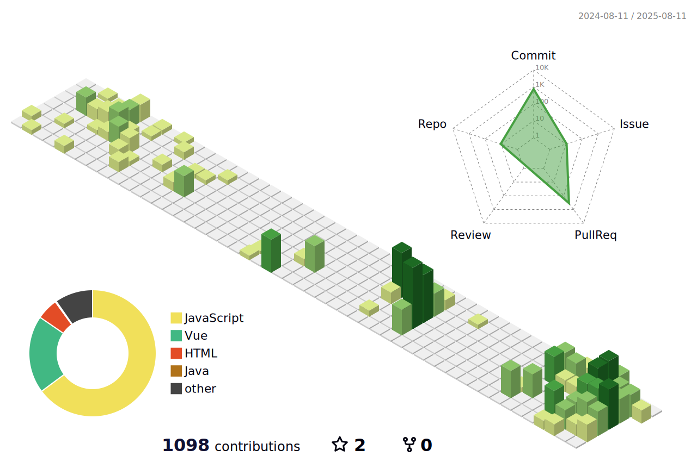

 

  😆About Me
  
   
  
  2019.3 ~ 2025.02 단국대학교 소프트웨어학과  
  2025.03 ~ KB IT's your life 부트캠프

 

<!--내용 부분-->
<h3 align="center">✨ Tech Stack ✨</h3>

  &nbsp
  &nbsp
  &nbsp

  &nbsp
  &nbsp

 

<h3 align="center">📚 Studying 📚</h3>

  &nbsp
  &nbsp

  &nbsp
  &nbsp

 

<h3 align="center">🛠 Tools 🛠</h3>

  &nbsp
  &nbsp

  &nbsp
  &nbsp

 

<h3 align="center">🏅 Awards 🏅</h3>

  2024.11 단국대학교 교내 캡스톤 경진대회 대상 👉 
  <a href="https://github.com/Hiking-Planner" target="_blank"><u>깃허브 바로가기</u></a>

 

  🏢 동아리 홈페이지 개발 👉 
  <a href="https://github.com/DKUAC" target="_blank"><u>깃허브 바로가기</u></a> 
  <a href="https://dkuac.co.kr"><u>DKUAC 홈페이지</u></a>

 
 

<!-- 2x2 그리드 -->
<table align="center">
  <tr>
    <td>
      
    </td>
    <td>
      
    </td>
  </tr>
  <tr>
    <td>
      
    </td>
    <td>
      
    </td>
  </tr>
</table>

